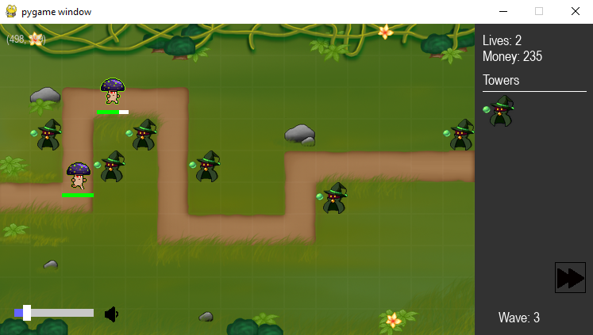

# Tower Defense Game
Development of a tower defense game where the player places down towers to prevent the waves of enemies from reaching the base. Each wave will have a certain number of enemies and should get more challenging each wave. The game should be engaging, requiring many different strategies to complete. The towers are placed on a map with the enemies coming towards the base along a predetermined path    


# How to run
Provide here instructions on how to use your application.
- There are two ways you can run the game:
- **Option 1:** Download a zip of the project to run the Main.exe in the 'dist' folder
- **Option 2:** clone the repository
    - Make sure Python is downloaded
        - You can download python on the Python Website:
        ```
        https://www.python.org/downloads/
        ```
        - Or download it from Microsoft Store (Windows)
        - Check if Python is installed:
            - Windows:
            ```
            python --version
            ```
            - Mac
            ```
            python3 --version
            ```
    - Install Visual Studio Code if it’s not already installed
    - Add the necessary extensions on VS code
        - Python Extension Pack
    - Download pygames by running this on the command line:
        - Windows:
        ```
        pip install pygame
        ```
        - Mac:
        ```
        pip3 install pygame
        ```
    - Run Main.py on VS code or on Terminal

# How to contribute
Follow this project board to know the latest status of the project: [https://github.com/orgs/cis3296s25/projects/66]([https://github.com/orgs/cis3296s25/projects/66])  

### How to build
- Use this github repository: ... 
- Specify what branch to use for a more stable release or for cutting edge development.  
- Use InteliJ 11
- Specify additional library to download if needed 
- What file and target to compile and run. 
- What is expected to happen when the app start. 
